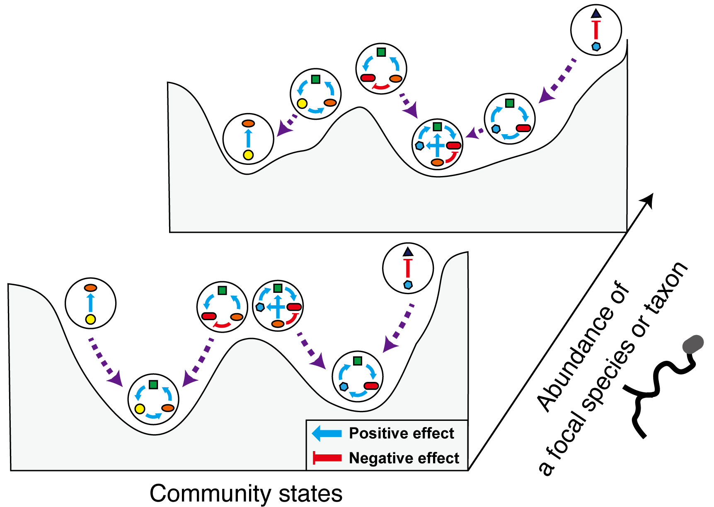

```{r setup, include=FALSE}
knitr::opts_chunk$set(eval = FALSE)
```
# Assembly Landscape of the Forest Root Microbiome
## Keystone Evaluation Framework Based on "Assembly Landscape"
We propose a novel framework for exploring keystone species or taxa within complex microbiomes. 
The assembly rules of the microbiome are inferred using a landscape analogy from community ecology, specifically through energy landscape analysis (Suzuki et al., 2021).
By extending this approach, we quantify the topographic shifts of the inferred landscape in relation to the abundance of focal species (or taxa). 
In this context, we explicitly conceptualize keystone species (or taxa) as those whose increases or decreases in abundance reorganize the rules governing microbiome assembly.


# Workflows
## Validation using generalized Lotka-Volterra simulations
Initially, we evaluated the performance of the proposed framework using generalized Lotka-Volterra models.

### Example

#### 0. Load Libraries and Original Functions
```{r}
library(rELA) #install.packages("packages/rELA.v0.60.tar.gz", type="source")

library(dplyr)
library(tidyverse)
library(doParallel)
library(igraph)
library(vegan)
library(cluster)

# Load custom functions for the analysis
source("examples/functions/functions_for_examples.R")
Rcpp::sourceCpp("examples/functions/ELA_functions_v060.cpp")

workflow_path="examples/WORKFLOW"
dir.create(workflow_path, showWarnings = FALSE)
```

#### 1. Generating community dynamics comprasing 80 species
```{r}
# Simulation parameters
total_sample <- 200
rep <- 200
nrep_eval <- 3
n.core <- 8

time <- 1000  # Total time for the simulation
Nsp <- c(80)  # Number of species
connectance <- 0.2  # Connectance in the network
A_self <- -1  # Self-interaction parameter

set <- expand.grid(Nsp, connectance, 1:rep) |>
  set_names(c("N", "C", "rep")) |>
  as.matrix()
```

##### Read parameters of Model 1
```{r}
A <- readRDS("examples/datasets/gLV_simulation/Amatrix_seed0.2.rds")[[1]]
r <- readRDS("examples/datasets/gLV_simulation/rparameter_seed0.2_Nsp80.rds")[[1]]
```

##### Run the simulation
```{r}

cluster <- makeCluster(n.core)
registerDoParallel(cluster)

dynamics <- foreach(
  n = 1:nrow(set),
  .packages = c("igraph", "tidyverse", "deSolve", "doParallel")
) %dopar%
  {
    s <- paste(set[n, 1:2], collapse = "_")
    N <- set[n, 1]
    r_set <- r

    mat <- gen_dyn(
      time = time, dt = 1000,
      A = A, r = r_set, N0 = runif(N), type = "gLV"
    )

    return(list(dynamics = mat))
  } |> set_names(apply(set, 1, paste, collapse = "_"))

stopCluster(cluster)
plt_dynamics(dynamics[[1]])
saveRDS(dynamics, sprintf("%s/01_simulation.rds", workflow_path))
```

#### 2. Sample Community Compositions from Simulated Dynamics
```{r}
# Create community matrix from simulated dynamics
dynamics = readRDS(sprintf("%s/01_simulation.rds", workflow_path))
non_pertabate <- map(dynamics, ~ .x[[1]])

sim_set <- matrix(unlist(strsplit(names(non_pertabate), "_")), ncol = 3, byrow = TRUE)

mat0 <- NULL
for (i in 1:nrow(sim_set[sim_set[, 2] == as.character(connectance), ])) {
  mat0 <- rbind(mat0, non_pertabate[[which(sim_set[, 2] == as.character(connectance))[i]]][sample(1:time, total_sample / rep), ])
}

d_bray <- vegdist(mat0, method = "bray")

# Create bins for correlation analysis
qt <- quantile(mat0, probs = c(0.1, 0.9))
bin_th <- seq(qt[1], qt[2], length.out = 30)

cr <- c()
for (i in 1:length(bin_th)) {
  cat("\r", i, "/", length(bin_th))
  bth <- bin_th[i]
  mat2 <- mat0
  mat2[mat2 <= bth] <- 0
  mat2[mat2 > 0] <- 1
  d_jac <- vegdist(mat2, method = "jaccard")
  cr[i] <- cor(d_bray, d_jac, method = "kendall")
}

max_cr <- which.max(cr)
best_bin_th <- bin_th[max_cr[order(max_cr)[1]]]

mat2 <- mat0
mat2[mat2 <= best_bin_th] <- 0
mat2[mat2 > 0] <- 1

saveRDS(mat0, sprintf("%s/02_abundance_data.rds", workflow_path))
saveRDS(mat2, sprintf("%s/02_PA_data.rds", workflow_path))
```

#### 3. Evaluate Species-Specific Influences on Community Dynamics
To make this process feasible on a local computer, we replicate this evaluation three times.
```{r}

cluster <- makeCluster(n.core)
registerDoParallel(cluster)  

kness <- foreach(
  n = 1:nrep_eval,
  .packages = c("igraph", "tidyverse", "deSolve", "doParallel")
) %dopar% {
  
  diff <- NULL
  N <- set[n, 1]
                  
  for (i in 1:N) {
    init <- c(runif(N - 1), 0.5)[order(c(c(1:N)[-i], i))]
    com_woi <- gen_dyn(time = time, dt = 1000, A = A[-i, -i], r = r[-i],
                       N0 = init[-i], type = "gLV")
    com_wi <- gen_dyn(time, dt = 1000, A, r,
                                     init, type = "gLV")[, -i]
                    
    abruptness_diffstart <- calc_aburptness(before = com_woi,
                                                           after = com_wi,
                                                           ab_th = best_bin_th)
                    
    names(abruptness_diffstart) <- paste0(names(abruptness_diffstart), "_diffstart")
                    
    diff <- rbind(diff, c(set[n, ], id = i, abruptness_diffstart[1:2]))
  }
                  
  keystoneness <- 
    data.frame(diff, r = r) |>
    left_join(calc_centrality(A), by = "id")
                  
  return(list(keystoneness = keystoneness))
}

stopCluster(cluster)
saveRDS(kness, sprintf("%s/03_keystonness_simulated.rds", workflow_path))

```
Calculation of keystonness
```{r}
kness = readRDS(sprintf("%s/03_keystonness_simulated.rds", workflow_path))

keystonness <- map_df(kness, ~ .x[[1]])

mBC2 <- foreach(i = 1:Nsp, .combine = "c") %do% {
  return(mean(keystonness[keystonness$id == i, "BC_diffstart"], na.rm = TRUE))
}

mJC2 <- foreach(i = 1:Nsp, .combine = "c") %do% {
  return(mean(keystonness[keystonness$id == i, "Jaccard_diffstart"], na.rm = TRUE))
}

key_res <- data.frame(sp = 1:Nsp,
                      mBC_diffstart = mBC2,
                      mJC_diffstart = mJC2)


```
#### 4. Energy Landscape Analysis
We evaluated species-specific influence on inferred assembly landscape topography. This process is too computationally intensive for a local computer; thus, we present a version with a reduced number of iterations in the parameter fitting and randomization process.
```{r}
mat0 = readRDS(sprintf("%s/02_abundance_data.rds", workflow_path))
mat2 = readRDS(sprintf("%s/02_PA_data.rds", workflow_path))

seed <- 12
n_itr <- 16
set.seed(seed)

mdp <- foreach(sp = 1:5, .packages = c("rELA", "doParallel", "tidyverse"), .combine = "rbind") %do% {
  print(sp)
  bin0 <- as.matrix(mat2[, -sp])
  bin <- bin0[, colMeans(bin0) > 0.1 & colMeans(bin0) < 0.9]
  res <- Quant_landshift(
    bin = bin, # Binary community matrix (samples x species)
    abundance_focal = mat0[, sp], # Abundance of the focal species
    qt_seq = c(0.5, 0.7), # Abundance quantiles to evaluate
    itr_fit = n_itr, qth = 10^-5, SS.itr = 150000
  ) # ELA parameters
  return(res)
}

saveRDS(mdp, sprintf("%s/04_ela_simulated.rds", workflow_path))

```

Null model simulations were also performed using permutations of the focal species' abundance.
```{r}
nrandamization <- 5

mdp <- readRDS(sprintf("%s/04_ela_simulated.rds", workflow_path))
stdDtop <- NULL
for (sp in 1:5) {
  cat(sprintf("%s\n", sp))

  mdp_rand <- foreach(rand = 1:nrandamization, .packages = c("rELA", "doParallel", "tidyverse")) %do% {
    bin0 <- as.matrix(mat2[, -sp])
    bin <- bin0[, colMeans(bin0) > 0.1 & colMeans(bin0) < 0.9]
    res <- Quant_landshift(
      bin = bin, # Binary community matrix (samples x species)
      abundance_focal = mat0[sample(nrow(mat0)), sp], # Abundance of the focal species
      qt_seq = c(0.5), # Abundance quantiles to evaluate
      itr_fit = n_itr, qth = 10^-5, SS.itr = 150000
    ) # ELA parameters
    return(res)
  }

  mdpr_all <- do.call(rbind, mdp_rand)

  z_dtopo <- (mdp[mdp$ra == "perc50", "d_land"] - mean(mdpr_all[mdpr_all$ra == "perc50", "d_land"])) / sd(mdpr_all[mdpr_all$ra == "perc50", "d_land"])
  p_dtopo <- sum(mdpr_all[mdpr_all$ra == "perc50", "d_land"] >= mdp[mdp$ra == "perc50", "d_land"]) / nrandamization

  stdDtop <- rbind(stdDtop, data.frame(sp = sp, z_delta_topography = z_dtopo, p_delta_topography = p_dtopo))
  cat("|\n")
}

saveRDS(stdDtop, sprintf("%s/04_ela_null_model_simulation.rds", workflow_path))

```

#### 5. Comparing the Proposed Index and Community-Scale Influence of Each Species
```{r}
influences <- merge(stdDtop, key_res, by = "sp")
cor.test(influences$z_delta_topography, influences$mBC_diffstart, method = "spearman")
plot(influences$z_delta_topography, influences$mJC_diffstart)

cor.test(influences$z_delta_topography, influences$mJC_diffstart, method = "spearman")
plot(influences$z_delta_topography, influences$mJC_diffstart)
```

### Scripts
**Analysis in the SuperComputer System**
working_directory_in_supercomputer/Script/05_01_gLV_simulation_Nsp80_260201.R
working_directory_in_supercomputer/Script/05_01_00_summarize_gLV_simulation_Nsp80_260201.R
working_directory_in_supercomputer/Script/05_02_ELA_withRA_multistep_eachseed_Nsp80_260201.R
working_directory_in_supercomputer/Script/05_03_randELA_withRA_4step_Nsp80_260201.R
working_directory_in_supercomputer/Script/05_04_summarize_ELA_withRA_4step_Nsp80_260202.R
working_directory_in_supercomputer/Script/05_05_Zconv_ELA_withRA_4step_Nsp80_260204.R
working_directory_in_supercomputer/Script/05_06_merge_result_eachseed_Nsp80_260131.R

---

## Bioinfomatics of a root microbiome dataset
We combined the root-tip fungal community datasets described in our previous study ([Noguchi and Toju *et al.*, 2024](https://doi.org/10.1002/ecm.1469)) with newly obtained prokaryotic data. The sequncing outputs of six Miseq runs were processed respectively (bioinfomatics pipelines were described in the corresponding "RunXX" directories and these outputs are in the directory "Base_data/Bioinfomatics/seqtab") and converted to a sample-OTU matrixusing the scripts in "Base_data/Bioinfomatics/Script".

We then applied coverage-based rarefaction to the 1,270 root fungal and prokaryotic community data-sets.

### Script
**Merge multiple sequence outputs**
Base_data/Bioinfomatics/Script/01_merge_and_decontm_2libararies.R
**Rarefaction**
Script_in_local_computer/01_LOO_covrarefy.R

## Energy Landscape Analysis for a root microbiome dataset
In the family-level taxonomic composition matrix, relative read counts for each family were binarized using the threshold. To make the subsequent energy landscape analysis computationally feasible, we prioritized families by their contribution to overall community structure as measured by PerMANOVA (*R²*). Among candidate family sets ranked by *R²*, we selected the set whose binarized pattern best matched the abundance-based community structure. Energy landscape analysis ([Suzuki *et al.*, 2021](https://doi.org/10.1002/ecm.1469)) was then performed using this selected family set together with host plant genera (encoded as dummy variables) as explanatory variables.

### Example
We show the analysis of fungal community as an example.
#### 0. loading package & original function
```{r}
library(ggplot2)
library(rELA)
library(vegan)
library(foreach)
library(doParallel)
library(tidyr)
library(compositions)
library(parallel)
library("Rcpp")
library("RcppArmadillo")
library("stringdist")
library("doParallel")
library("tidyverse")
library("gtools")
library("igraph")
library("ggtext")
library("ggforce")
library(ggstar)

# Load custom functions
source("packages/01_1_function.R")
source("examples/functions/functions_for_examples.R")

```

#### 1. Data processing
Binarization
```{r}
# Data loading
fb <- "Fungi"

# Meta-data
info <- readRDS("examples/datasets/ELA_Fungi/comp_sample_info_plant2.rds")
relf <- readRDS("examples/datasets/ELA_Fungi/Comm_mat.rds")
sp_info <- readRDS("examples/datasets/ELA_Fungi/ELA_input_plant.rds")

unident_th <- 0.5 # Threshold for unidentified taxa

# Binarization
relf2 <- relf$filtered
ocmat <- binarize_M2SD(relf2)
```
Taxa selection
```{r}
relf_all <- relf$all_taxa / rowSums(relf$all_taxa)
relf3 <- relf_all[which(relf_all[, "Unidentified"] < unident_th & rownames(relf_all) %in% rownames(ocmat)), ]

ocmat2 <- ocmat[rownames(relf3), ]
ocmat3 <- ocmat2[, which(colSums(ocmat2) > 30 & colSums(ocmat2) < nrow(ocmat2) - 30)]

CTRL.t <- how(
  within = Within(type = "free"),
  plots = Plots(type = "none"),
  blocks = paste0(
    info[rownames(ocmat3), c("plant")],
    info[rownames(ocmat3), c("site")]
  ),
  nperm = 10, # In original analysis, we set nperm = 10000
  observed = TRUE
)

r2_each <- prioritize_adonis2(
  bin_mat = ocmat3,
  ab_mat = relf3[,colnames(ocmat3)],
  ex_var = info[rownames(ocmat3), c("plant", "site")],
  nperm = CTRL.t,
  n.core = n.core,
  dist_method = "bray"
)

bin_ab_cor <- find_best_Spset(
  bin_mat = ocmat3,
  ab_mat = relf3[,colnames(ocmat3)],
  priority = r2_each$taxa[order(r2_each$R2, decreasing = TRUE)],
  min_nSp = 20,
  max_nSp = 50,
  n.core = n.core,
  method_bin_dist = "jaccard",
  method_ab_dist = "bray"
)

bin_ab_cor$best <- FALSE
bin_ab_cor[order(bin_ab_cor$tau, -bin_ab_cor$nSp, decreasing = TRUE)[1], "best"] <- TRUE

best_bin_mat <- ocmat3[, r2_each$taxa[order(r2_each$R2, decreasing = TRUE)[1:bin_ab_cor[which(bin_ab_cor$best), "nSp"]]]]

saveRDS(best_bin_mat, "examples/datasets/ELA_Fungi/ELA_input_ocmat_Fungi.rds")

# Plotting the results
g <- ggplot(bin_ab_cor, aes(x = nSp, y = tau)) +
  geom_line() +
  geom_point() +
  geom_star(data = function(x) {
    x[x$best, ]
  }, starshape = 1, fill = "darkorange", size = 4) +
  labs(x = "Number of Species", y = "Kendall's Correlation Coefficients") +
  theme_bw() +
  theme(
    aspect.ratio = 1,
    strip.text = element_text(size = 15),
    axis.title = element_text(size = 15),
    axis.text = element_text(size = 13)
  )
g
```

#### 2. Energy landscape analysis
```{r}
om <- readRDS("examples/datasets/ELA_Fungi/ELA_input_ocmat_Fungi.rds") # best_bin_mat

## Energy landscape analysis
# ELA parameters
qth <- 10^-5
SS.itr <- 150000
n.core <- 8
fb <- "Fungi"
maj_th <- 0.01

sa <- runSA(ocmat=as.matrix(om),
            enmat = sp_info[rownames(om),-c(1,ncol(sp_info))],
            qth=qth, rep=1280, threads=n.core)

pltab <- unique(sp_info[rownames(om),-c(1,ncol(sp_info))])

ela <- detected_ss <- c()
for(pl in 1:nrow(pltab)){#pl <- 4
  if(sum(pltab[pl,]==1)){
    plnam <- colnames(pltab)[which(pltab[pl,]==1)]
  }else{
    plnam <- colnames(sp_info)[ncol(sp_info)]
  }
  pocm <- om[which(rownames(om) %in% info[info$plant==plnam,"ID"]),]
  
  sa2p <- sa2params(sa,as.numeric(pltab[pl,]))
  
  hgestp <- sa2p[[4]]
  jestp <- sa2p[[2]]
  
  ela[[pl]] <- ELA(sa, env=as.numeric(pltab[pl,]),
                   SS.itr=SS.itr, FindingTip.itr=10000, # <- the number of steps for finding stable states and tipping points (basically no need to change)
                   threads=n.core, reporting=TRUE)
  
  ss <- ela[[pl]][[1]]
  
  cluster = makeCluster(n.core)
  registerDoParallel(cluster)
  
  samp_ss <- foreach(i=1:nrow(pocm),
                     .packages = c("rELA","foreach"),.combine = "c")%dopar%{
                       Bi(pocm[i,],
                          hgestp,jestp)[[1]]
                     }
  
  stopCluster(cluster)
  
  detected_ss <- rbind(detected_ss,
                       cbind(plant=plnam,
                             SS=ss[ss %in% names(table(samp_ss))[table(samp_ss)/length(samp_ss)>maj_th]],
                             ncol=ncol(pocm)))
}

maj_s <- unique(detected_ss[,"SS"])

sscf <- t(sapply(maj_s,id2bin,ncol(om)))
colnames(sscf) <- colnames(om)
rownames(sscf) <- maj_s
#SS taxa binary heatmap
sscf2 <- unique(sscf[,colSums(sscf)>0])

#disconnectivity graphs
for(pl in 1:nrow(pltab)){#pl <- 4
  showDG_mod(ela[[pl]], om,
             SS_colmat= as.data.frame(matrix(detected_ss[ss_pl,],ncol=3,
                                                          dimnames = list(ss_pl,c("SS","rename_SS","color")))),
             label=sprintf("%s",plnam),
             na.color="black",
             minor.color = "gray50",
             annot_adj=c(0.5, 2.00))
}
```

### Scripts
**Energy landscape analysis in the SuperComputer System**
working_directory_in_supercomputer/Script/02_06_ELA.R
working_directory_in_supercomputer/Script/02_07_assemblygraph_onlyBasin.R

**Some graphics**
These script run after the analyses about flow diagrams of energy landscape.
Script_in_local_computer/03_11_SSheatmap_fullELA_recolor_250501.R Script_in_local_computer/03_12_DG_fullELA_recolor.R

---

## Statistical Inference of Keystone Taxa

Starting from the original data matrix with OTUs annotated as the focal genus removed, we performed coverage-based rarefaction. Binarization used the same family set as in the energy landscape analysis described above. In parallel, we rarefied the full community matrix and applied a centered log-ratio (CLR) transformation to genus-level compositions. 


We then performed energy landscape analysis including host plant genera (dummy variables) and the CLR-transformed relative abundance of the focal genus as external variables. "Keystoneness" indices were computed by comparing energy landscapes inferred under two conditions: (1) without the focal genus and (2) with the focal genus fixed at representative abundances (25%, 50%, and 75% quantiles of its observed relative abundance), using community assembly simulations.

### Example
We demonstrated this process using the fungal genus Oidiodendron as an example.
#### 0. loading data & functions
```{r}
library(parallel)
library(foreach)
library(vegan)
library("Rcpp")
library("RcppArmadillo")
library("doParallel")
library("tidyverse")
library("gtools")
library("igraph")
library("RColorBrewer")
library("stringdist")
library("rELA")

source("examples/functions/functions_for_examples.R")
# Source custom C++ and R functions
Rcpp::sourceCpp("examples/functions/ELA_functions_v060.cpp")
```
Input Data Preparation
```{r}
# Load the sample information and community matrices
info <- readRDS("examples/datasets/ELA_Fungi/comp_sample_info_plant2.rds")
relf <- readRDS("examples/datasets/ELA_Fungi/Comm_mat.rds")
sp_info <- readRDS("examples/datasets/ELA_Fungi/ELA_input_plant.rds")
ocmat <- readRDS("examples/datasets/ELA_Fungi/ELA_input_ocmat_Fungi.rds") # Best binarized matrix

# Load abundance data for genera
tb_gns <- readRDS("examples/datasets/ELAbased_keystone_exploration/NoCLR_ExpVar_clrRA_target_taxa.rds")
tb_g <- readRDS("examples/datasets/ELAbased_keystone_exploration/ExpVar_clrRA_target_taxa.rds")

# Load the data for the focal genus
df <- readRDS("examples/datasets/ELAbased_keystone_exploration/matrix_list_Oidiodendron.rds")
```
Data Binarization
```{r}
# Extract abundance matrices for fungi
abmat <- tb_g[["Fungi"]]
ramat <- tb_gns[["Fungi"]]

# Determine presence of taxa based on abundance
which_pres <- Bin_2sd(ramat[, colSums(ramat > 0) > 30])
dimnames(which_pres) <- dimnames(ramat[, colSums(ramat > 0) > 30])

# Create taxa matrix
f <- Taxa.mat(df$Fungi, tx_f, "Family")

# Normalize the taxa matrix
f1 <- f / rowSums(f)

# Filter taxa that are present in the original community matrix
f1 <- f1[
  which(rownames(f1) %in% rownames(ocmat$Fungi)),
  which(colnames(f1) %in% colnames(ocmat$Fungi))
]

# binarization of the filtered taxa matrix
f2 <- Bin_2sd(f1)
dimnames(f2) <- dimnames(f1)
```
#### 1. Energy landscape analysis for community without *Oidiodendron*
In this section, we performed energy landscape analysis specifically for the community without the focal genus Oidiodendron. 
```{r} 
# Set parameters for energy landscape analysis
qth <- 10^-5 # Threshold for significance
SS.itr <- 20000 # Number of iterations for the simulated annealing

# Generate initial states for the simulated annealing process
statef <- foreach(i = 1:SS.itr, .combine = "rbind") %do% {
  st <- runif(ncol(ocmat$Fungi), 0, 2) |> as.integer()
}
rownames(statef) <- sprintf("Start_%05d", 1:SS.itr)

# Filter the community matrix based on abundance
ocmatf <- f2[, which(colSums(f2) > 30)]

# Prepare the environmental matrix for analysis
enmatf <- cbind(
  RA = scale(abmat[rownames(ocmatf), "Oidiodendron"]),
  sp_info[rownames(ocmatf), -c(1, ncol(sp_info))]
)

# energy landscape analysis
sa <- runSA(
  ocmat = as.matrix(ocmatf), enmat = enmatf,
  qth = qth, rep = 16, threads = n.core
) # Set a manageable number of iterations for local computer

# Create input initial states for further analysis
hg <- sa2params(sa)[[4]]
state <- foreach(i = 1:SS.itr, .combine = "rbind") %do% {
  st <- runif(length(hg), 0, 2) |> as.integer()
}
rownames(state) <- sprintf("Start_%05d", 1:SS.itr)
```
#### 2.Evaluate community-scale influences
```{r}
cat("processing(")
cat(nrow(unique(sp_info[, -1])))
cat(") |")

# Loop through each unique plant to assess its influence
for (pl in 1:nrow(unique(sp_info[, -1]))) { # Loop through each plant
  cat("=")
  plmat <- unique(sp_info[, -c(1, ncol(sp_info))])[pl, ]

  # Determine plant name based on unique identifiers
  if (sum(plmat[1, ] == 1) == 1) {
    pl_nam <- colnames(plmat)[which(plmat[1, ] == 1)]
  } else {
    if (all(plmat[1, ] == 0)) {
      pl_nam <- colnames(sp_info)[ncol(sp_info)]
    }
  }

  pnam[pl] <- pl_nam

  # Extract sample IDs for the current plant
  psamp <- info[info$plant == pl_nam, "ID"]
  ra <- enmatf[which(rownames(enmatf) %in% psamp), "RA"]
  ra_noclr <- ramat[
    rownames(enmatf)[which(rownames(enmatf) %in% psamp)],
    "Oidiodendron"
  ]
  wpres <- which_pres[
    rownames(enmatf)[which(rownames(enmatf) %in% psamp)],
    "Oidiodendron"
  ]

  # Calculate percentiles for the relative abundance
  ra_perc <- quantile(ra[wpres == 1], c(0.25, 0.5, 0.75))
  ran_perc <- quantile(ra_noclr[wpres == 1], c(0.25, 0.5, 0.75))

  # Calculate species-specific influences
  sprop[[pl]] <- SSchange(
    state = state,
    sa = sa,
    steps = 3,
    RA_label = c("perc25", "median", "perc75"),
    env_cat = plmat, reporting = FALSE,
    start = mean(ra[wpres == 0]),
    range = c(ra_perc[1], ra_perc[2], ra_perc[3]),
    eq_steps = FALSE,
    SS.itr = SS.itr, threads = n.core
  )

  md_sprop <- rbind(md_sprop, cbind(
    plant = pl_nam, ab = c(
      ran_perc[1],
      ran_perc[2],
      ran_perc[3]
    ),
    sprop[[pl]][["result"]]
  ))
  cat("|\n")
}

# Combine results into a data frame
mdp <- cbind(Taxa = "Oidiodendron", md_sprop)
```
We also performed null model simulations using host plant-restricted permutations of the focal species' abundance.
```{r}
nrandamization <- 1000  # Number of randomizations
rsprop <- list(NULL)
rpnam <- c()
rmd_sprop <- NULL

# Loop for randomization
for (rand in 1:nrandamization) {
  rab <- blockSample(cbind(abmat[rownames(ocmatf),],
                           ramat[rownames(ocmatf),],
                           which_pres[rownames(ocmatf),]),
                     info[rownames(ocmatf), "plant"],
                     rownames(ocmatf))
  
  rabmat <- rab$matrix[, 1:ncol(abmat)]
  
  rramat <- rab$matrix[, (ncol(abmat) + 1):(ncol(abmat) + ncol(ramat))]
  rwhich_pres <- rab$matrix[, (ncol(abmat) + ncol(ramat) + 1):ncol(rab$matrix)]
  
  # Prepare environmental matrix for the randomized data
  enmatf <- cbind(RA = scale(rabmat[rownames(ocmatf), "Oidiodendron"]),
                  sp_info[rownames(ocmatf), -c(1, ncol(sp_info))])
  
  # Run simulated annealing for the randomized matrix
  sa <- runSA(ocmat = as.matrix(ocmatf), enmat = enmatf,
              qth = qth, rep = 16, threads = n.core)
  
  hg <- sa2params(sa)[[4]]
  state <- statef[, sample(length(hg))]  # Randomize the state
  
  # Loop through each unique plant for evaluation
  for (pl in 1:nrow(unique(sp_info[,-1]))) {
    cat("=")
    plmat <- unique(sp_info[,-c(1, ncol(sp_info))])[pl,]
    
    if (sum(plmat[1, ] == 1) == 1) {
      pl_nam <- colnames(plmat)[which(plmat[1, ] == 1)]
    } else {
      if (all(plmat[1, ] == 0)) {
        pl_nam <- colnames(sp_info)[ncol(sp_info)]
      }
    }
    
    rpnam[pl] <- pl_nam
    
    psamp <- info[info$plant == pl_nam, "ID"]
    ra <- enmatf[which(rownames(enmatf) %in% psamp), "RA"]
    ra_noclr <- rramat[rownames(enmatf)[which(rownames(enmatf) %in% psamp)],
                        "Oidiodendron"]
    wpres <- rwhich_pres[rownames(enmatf)[which(rownames(enmatf) %in% psamp)],
                         "Oidiodendron"]
    
    ra_perc <- quantile(ra[wpres == 1], c(0.25, 0.5, 0.75))
    ran_perc <- quantile(ra_noclr[wpres == 1], c(0.25, 0.5, 0.75))
    
    # Calculate species-specific influences for randomized data
    rsprop[[pl]] <- SSchange(state = state,
                             sa = sa,
                             steps = 3,
                             RA_label = c("perc25", "median", "perc75"),
                             env_cat = plmat, reporting = FALSE,
                             start = mean(ra[wpres == 0]),
                             range = c(ra_perc[1], ra_perc[2], ra_perc[3]),
                             eq_steps = FALSE,
                             SS.itr = SS.itr, threads = n.core)
    rmd_sprop <- rbind(md_sprop, cbind(plant = pl_nam, ab = c(ran_perc[1],
                                                               ran_perc[2],
                                                               ran_perc[3]),
                                      rsprop[[pl]][["result"]]))
  }  
}

```
Results Compilation
Finally, we compile the results of our analyses into a structured output.
```{r}
m <- md_sprop
r <- rmd_sprop
stdDtop <- NULL

# Calculate z-scores and p-values for each plant
for (i in 1:length(pl_nam)) {
  z_dtopo <- (m[m$ra == "perc50" & m$plant == pl_nam[i], "d_land"] - 
               mean(r[r$ra == "perc50" & r$plant == pl_nam[i], "d_land"])) / 
               sd(r[r$ra == "perc50" & r$plant == pl_nam[i], "d_land"])
  
  z_deven <- (m[m$ra == "perc50" & m$plant == pl_nam[i], "d_even"] - 
               mean(r[r$ra == "perc50" & r$plant == pl_nam[i], "d_even"])) / 
               sd(r[r$ra == "perc50" & r$plant == pl_nam[i], "d_even"])
  
  p_dtopo <- sum(r[r$ra == "perc50" & r$plant == pl_nam[i], "d_land"] >= 
                 m[m$ra == "perc50" & m$plant == pl_nam[i], "d_land"]) / nrandamization
  
  p_deven <- ifelse(z_deven > 0,
                    sum(r[r$ra == "perc50" & r$plant == pl_nam[i], "d_even"] >= 
                        m[m$ra == "perc50" & m$plant == pl_nam[i], "d_even"]) / nrandamization,
                    sum(r[r$ra == "perc50" & r$plant == pl_nam[i], "d_even"] <= 
                        m[m$ra == "perc50" & m$plant == pl_nam[i], "d_even"]) / nrandamization)
  
  stdDtop <- rbind(stdDtop, data.frame(plant = pl_nam[i],
                                       z_delta_topography = z_dtopo,
                                       z_delta_evenness = z_deven,
                                       p_delta_topography = p_dtopo,
                                       p_delta_evenness = p_deven))
}

# Print the results of the standard deviations
print(stdDtop)

```
### Script
**Community assembly simulations**
working_directory_in_supercomputer/Script/03_01_ELA_withRA_4step.R

**Null model simulations**
working_directory_in_supercomputer/Script/03_02_randELA_withRA_4s_fixPS_1_3000.R
working_directory_in_supercomputer/Script/03_02_randELA_withRA_4s_fixPS_3001_6000.R
working_directory_in_supercomputer/Script/03_02_randELA_withRA_4s_fixPS_6001_9000.R
working_directory_in_supercomputer/Script/03_02_randELA_withRA_4s_fixPS_9001_10500.R
working_directory_in_supercomputer/Script/03_02_summarize_randELA_withRA_fixP_250306.R

**Evaluation variances of the keystoneness metrics**
working_directory_in_supercomputer/Script/03_03_ELA_withRA_4step_rep.R
working_directory_in_supercomputer/Script/03_04_landscape_change_repuroducibility.R

**Flow diagrams**
working_directory_in_supercomputer/Script/03_05_states_flow_diagram.R

**graphics**

Script_in_local_computer/03_06_Zhistgram_250321.R Script_in_local_computer/03_07_graphics_Zconv_landchanges_biplot_250312.R Script_in_local_computer/03_08_Zeven_abundance_occurence_250507.R Script_in_local_computer/03_08_Zland_abundance_occurence_250507.R Script_in_local_computer/03_10_02_graphics_Fullstates_flow_Spl_250813.R 


## Additional analyses
### Scripts

Script_in_local_computer/02_08_hostpreference_Family.R
Script_in_local_computer/04_rarefaction_barplot.R

## Repository Contents


- `Base_data/` — Raw datasets used in this study.
- `Output/` — Results produced on the local computer (some large folders excluded).
- `Output_supercomputer/` — Results produced on the supercomputer (some large folders excluded).
- `Script_in_local_computer/` — R scripts used for analyses on the local computer.
- `packages/` — R packages and custom source code used for local analyses.
- `working_directory_in_supercomputer/` — Working directory structure used on the supercomputer, containing the analysis scripts (`Script/`) and additional data prepared on the local computer (`Import_data/`, `color/`). Note: `Base_data/` and `packages/` referenced here are not duplicated in this repository.

