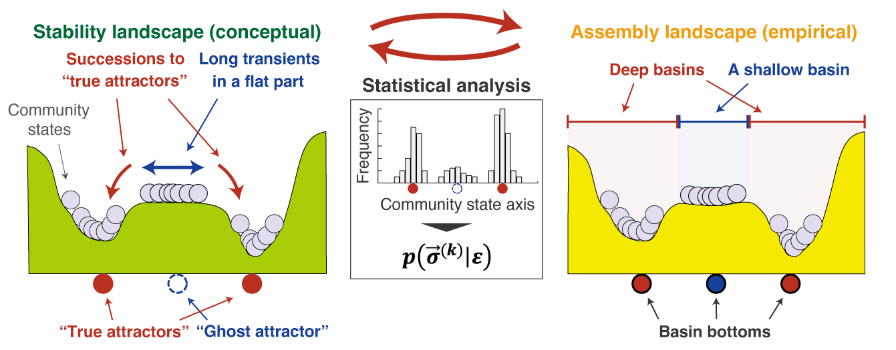
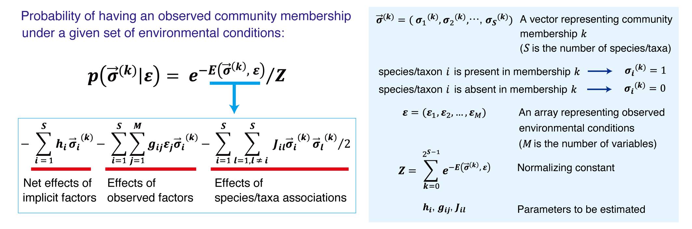
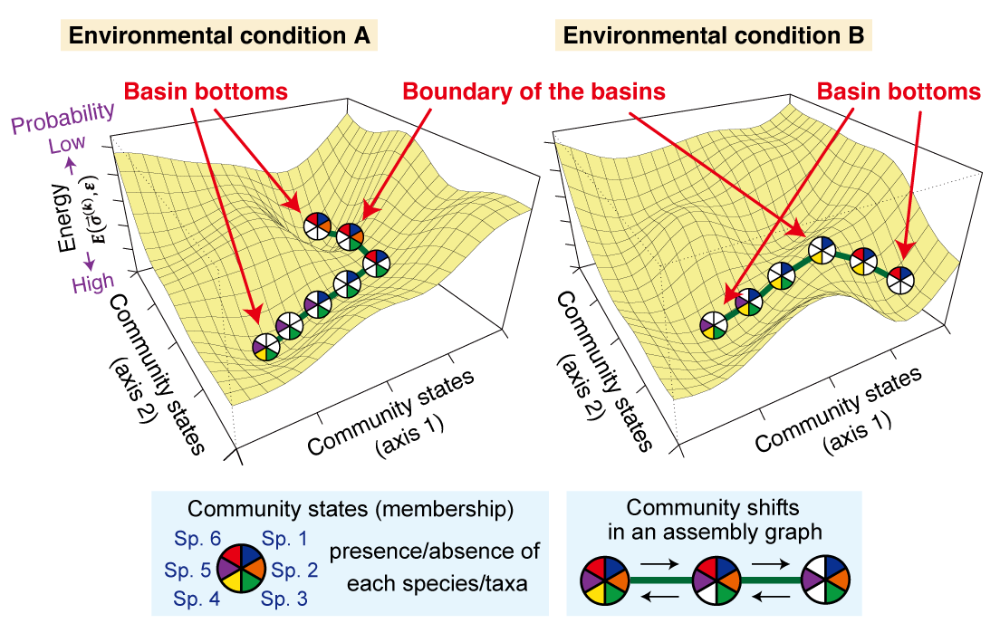
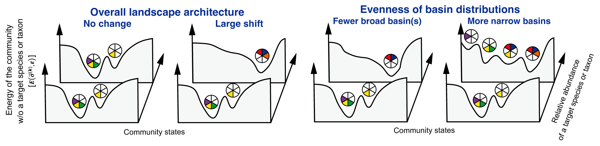
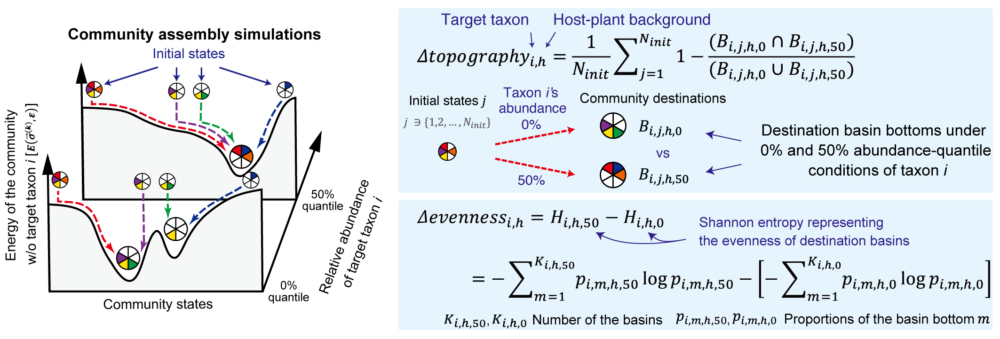
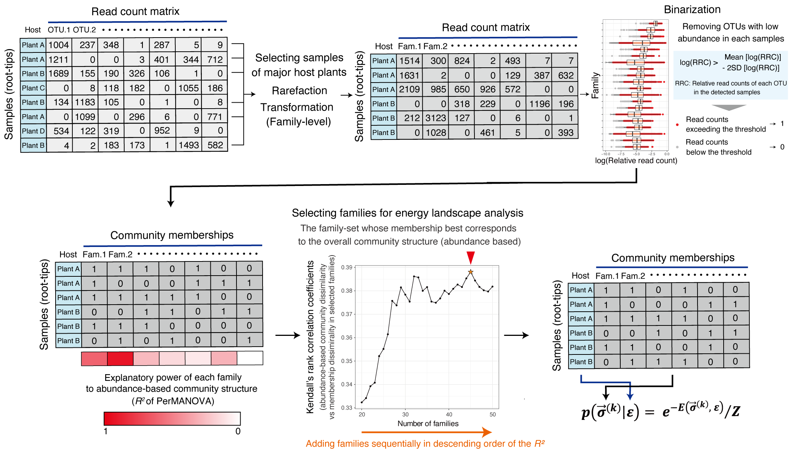
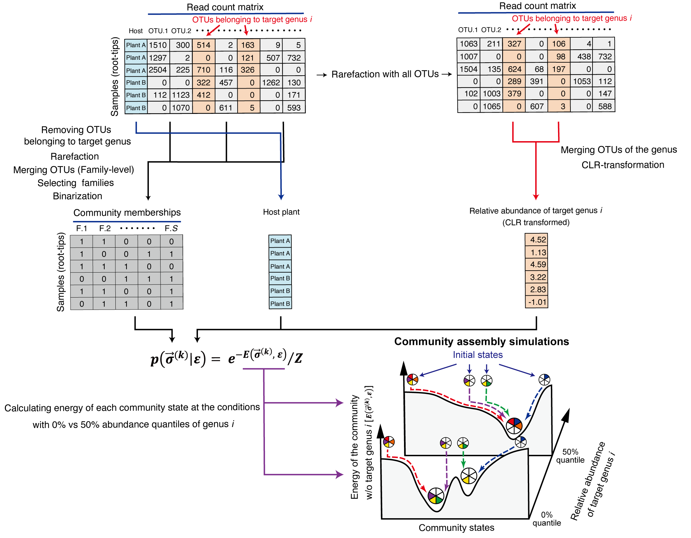

# Assembly Landscape of the Forest Root Microbiome

This repository presents the "assembly landscape" concept and the algorithms for keystone inference based on that concept.

# Relationship between Classical Stability Landscapes and Empirically Reconstructed Assembly Landscapes

The stability landscape concept illustrates the relationship between community structure and ecological stability (Fig. 1-left). In contrast, assembly landscapes reconstructed from empirical data describe the statistical relationship between observed community states and their probabilities (Fig. 1-right). 

Both convergence toward true attractors and prolonged transients around a "ghost attractor" in the conceptual stability landscape can produce clustered observations in empirical datasets. In the assembly landscape, assembly toward true attractors appears as deep basins, whereas prolonged transients around ghost attractors are inferred as shallow basins.

*Fig. 1| Conceptual stability landscape (left) and empirically reconstructed assembly landscapes (right).*

# Empirical Estimation Using Energy Landscape Analysis

Based on the Ising model in statistical physics, the probability of observing a given community state (membership) can be expressed as a linear combination of effects from implicit (unobserved) factors, explicit (observed) factors, and associations among species/taxa ([Suzuki *et al.*, 2021](https://doi.org/10.1002/ecm.1469)). 

Lower "energy" values correspond to more probable community states. We model the landscape topography as dependent on background environmental conditions.

*Fig. 2| Energy landscape analysis.*

Based on the maximum-entropy fitting of the model parameters, the "energy" of each community state is inferred. The topography of the "energy landscape" is assumed to change depending on background environmental conditions. Community assembly is assumed to proceed toward basin bottoms within the "assembly graphs," in which community states that differ by the presence or absence of a single species are connected by a single step.

*Fig. 3| Statistically reconstructed assembly landscapes.*

# Keystone Concept Based on Assembly Landscape Reorganization

Given that assembly landscapes represent community assembly rules, “keystone microbes” can be defined as one whose changes in abundance drastically change the landscape architecture. The extent of the landscape reorganization is quantitatively evaluated in terms of changes in the composition and distribution of basin bottoms (*Δtopography*; left) and changes in the evenness of basin distributions (*Δevenness*; right) along the abundance gradient of a focal species/taxon.

*Fig. 4| Large shift in the assembly landscape architecture.*

We quantify landscape reorganization using two metrics along the abundance gradient of a focal taxon: changes in the overall landscape architecture (*Δtopography*; Fig. 5-left) and changes in the evenness of basin distributions (*Δevenness*; Fig. 5-right).

Specifically, we ran community assembly simulations with 20,000 randamly generated initial communities on the inferred landscapes and computed the mean Jaccard distance between corresponding destinations (basin bottoms) as Δtopography. Similarly, Δevenness was defined as the difference in Shannon entropy of the distributions of the basin proportions between the two landscapes under different abundance scenarios.

*Fig. 5| "Kestoneness" metrics.*

# Workflows in this Study

## Energy Landscape Analysis

We applied coverage-based rarefaction to the 1,270 root fungal and prokaryotic community data-sets ([Noguchi and Toju *et al.*, 2024](https://doi.org/10.1002/ecm.1469)). In the family-level taxonomic composition matrix, relative read counts for each family were binarized using the threshold described in Figure 6. To make the subsequent energy landscape analysis computationally feasible, we prioritized families by their contribution to overall community structure as measured by PerMANOVA (*R²*). Among candidate family sets ranked by *R²*, we selected the set whose binarized pattern best matched the abundance-based community structure. Energy landscape analysis was then performed using this selected family set together with host plant genera (encoded as dummy variables) as explanatory variables.

*Fig. 6| Input data for energy landscape analysis.*

## Statistical Inference of Keystone Taxa

Starting from the original data matrix with OTUs annotated as the focal genus removed, we performed coverage-based rarefaction. Binarization used the same family set as in the energy landscape analysis described above. In parallel, we rarefied the full community matrix and applied a centered log-ratio (CLR) transformation to genus-level compositions. 

We then performed energy landscape analysis including host plant genera (dummy variables) and the CLR-transformed relative abundance of the focal genus as external variables. "Keystoneness" indices were computed by comparing energy landscapes inferred under two conditions: (1) without the focal genus and (2) with the focal genus fixed at representative abundances (25%, 50%, and 75% quantiles of its observed relative abundance), using community assembly simulations.

*Fig. 7| Input data for the keystone exploration.*

## Repository Contents

- `Base_data/` — Raw datasets used in this study.
- `Output/` — Results produced on the local computer (some large folders excluded).
- `Output_supercomputer/` — Results produced on the supercomputer (some large folders excluded).
- `Script_in_local_computer/` — R scripts used for analyses on the local computer.
- `packages/` — R packages and custom source code used for local analyses.
- `working_directory_in_supercomputer/` — Working directory structure used on the supercomputer, containing the analysis scripts (`Script/`) and additional data prepared on the local computer (`Import_data/`, `color/`). Note: `Base_data/` and `packages/` referenced here are not duplicated in this repository.

# Contents in this repository

We conducted series of the snalyses in this study using SuperComputer System, Institute for Chemical Research, Kyoto University. The outputs in the local computer and the SuperComputer System were uploaded separetely.

Base_data: Raw data-sets used in this study

Output: Output of analyses using the local computer. some large folders were excluded

Output_supercomputer: Output of analyses using the SuperComputer System. some large folders were excluded

Script_in_local_computer: R script for analyses using using the local computer.

packages: R packages and original source codes for analyses using the local computer.

working_directory_in_supercomputer: The working directory in the SuperComputer System. The directory contains R script for analyses using ("Script") and addtional data for analyses prepared in the local computer ("Import_data" and "color"). The directories "Base_data" and "packages", which also included there, were excluded in this repository.

